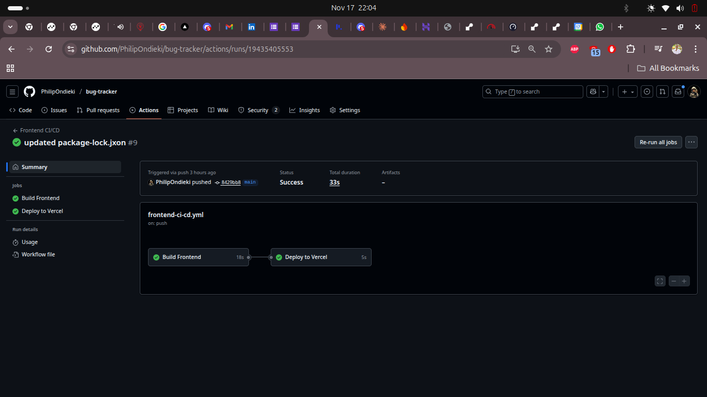
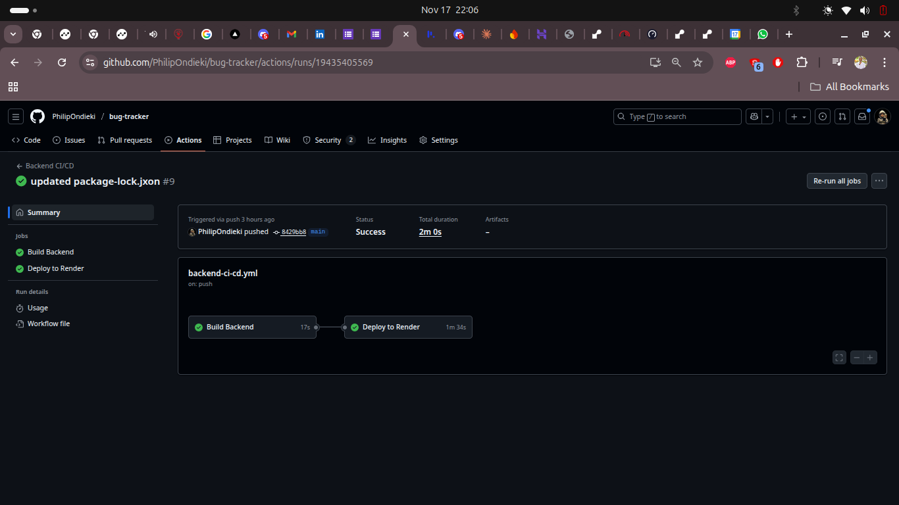

# 📊 Monitoring Setup Documentation

## Overview

This document describes the monitoring setup for the MERN Bug Tracker application. We use **built-in monitoring tools** provided by our hosting platforms - no additional setup required.

---

## 🎯 What We Monitor

| Metric | Tool | Access |
|--------|------|--------|
| Backend Health | Render Dashboard | https://dashboard.render.com |
| Frontend Performance | Vercel Analytics | https://vercel.com/dashboard |
| API Uptime | Health Endpoint | https://bugtracker-api-8vr8.onrender.com/health |
| Application Logs | Render/Vercel Logs | Dashboard |
| Deployment Status | GitHub Actions | Repository → Actions tab |

---

## 🖥️ Backend Monitoring (Render)

### Built-in Features

Render provides free monitoring for all services:

#### 1. **Service Status**
- **Location**: Render Dashboard → Your Service
- **Shows**: Live/Building/Failed status with green/yellow/red indicators
- **Real-time**: Updates automatically

#### 2. **Logs**
- **Location**: Render Dashboard → Logs tab
- **Features**:
  - Real-time log streaming
  - Error tracking
  - Request/response logs
  - Database connection logs
- **Usage**: 
  ```bash
  # View logs in dashboard or via CLI
  render logs bugtracker-api --tail
  ```

#### 3. **Metrics**
- **Location**: Render Dashboard → Metrics tab
- **Tracks**:
  - CPU usage
  - Memory usage
  - Request count
  - Response times
  - Bandwidth

#### 4. **Health Check Endpoint**
- **URL**: https://bugtracker-api-8vr8.onrender.com/health
- **Response**:
  ```json
  {
    "success": true,
    "message": "Server is running",
    "timestamp": "2024-11-17T15:00:00.000Z"
  }
  ```
- **Check Manually**:
  ```bash
  curl https://bugtracker-api-8vr8.onrender.com/health
  ```

#### 5. **Deployment History**
- **Location**: Render Dashboard → Events tab
- **Shows**: All deployments, successes, and failures
- **Features**: One-click rollback to previous versions

---

## 🌐 Frontend Monitoring (Vercel)

### Built-in Features

Vercel provides comprehensive monitoring for free:

#### 1. **Deployment Status**
- **Location**: Vercel Dashboard → Deployments
- **Shows**: 
  - Build status (Success/Failed)
  - Build time
  - Deployment preview URLs
- **Features**: Instant rollback capability

#### 2. **Analytics** (Built-in)
- **Location**: Vercel Dashboard → Analytics tab
- **Free Tier Includes**:
  - Page views
  - Top pages
  - Top referrers
  - Geographic data
  - Device breakdown
- **No Setup Required**: Automatically enabled

#### 3. **Logs**
- **Location**: Vercel Dashboard → Logs tab
- **Shows**:
  - Function logs
  - Build logs
  - Error logs
  - Request logs

#### 4. **Performance Monitoring**
- **Location**: Vercel Dashboard → Speed Insights
- **Tracks**:
  - Page load times
  - Time to First Byte (TTFB)
  - First Contentful Paint (FCP)
  - Largest Contentful Paint (LCP)
  - Cumulative Layout Shift (CLS)

---

## 🔄 CI/CD Monitoring (GitHub Actions)

### Workflow Status

**Location**: GitHub Repository → Actions tab

**What We Monitor**:
- ✅ Build success/failure
- ✅ Deployment status
- ✅ Workflow run time
- ✅ Job-level details

**Notifications**:
- Email alerts on workflow failures (automatic)
- Status badges in README (optional)

**Example Workflow Status**:
```
Backend CI/CD: ✅ Passing
Frontend CI/CD: ✅ Passing
Last run: 2 minutes ago
```

---

## 📈 Monitoring Dashboards

### Daily Monitoring Routine (5 minutes)

1. **Check Render Dashboard**
   - Service status: 🟢 Live
   - Recent logs: No errors
   - Memory/CPU: Normal

2. **Check Vercel Dashboard**
   - Latest deployment: ✅ Success
   - Analytics: Review traffic
   - Errors: Check for any 4xx/5xx

3. **Check GitHub Actions**
   - Latest workflows: ✅ Passing
   - No failed builds

4. **Test Health Endpoint**
   ```bash
   curl https://bugtracker-api-8vr8.onrender.com/health
   # Should return: {"success":true,"message":"Server is running"}
   ```

---

## 🚨 Alert System

### Automatic Alerts (No Setup Required)

#### Render Alerts
- **Email notifications** when:
  - Deployment fails
  - Service goes down
  - Build fails

#### Vercel Alerts
- **Email notifications** when:
  - Deployment fails
  - Build errors occur
  - Domain issues

#### GitHub Actions Alerts
- **Email notifications** when:
  - Workflow fails
  - Build breaks

### Manual Monitoring Commands

```bash
# Check backend health
curl https://bugtracker-api-8vr8.onrender.com/health

# Check frontend is accessible
curl -I https://bug-tracker-zeta-pied.vercel.app

# Check API endpoint
curl https://bugtracker-api-8vr8.onrender.com/api/bugs
```

---

## 📊 Key Metrics to Track

### Backend (Render)
| Metric | Target | How to Check |
|--------|--------|--------------|
| Uptime | 99%+ | Render Dashboard → Metrics |
| Response Time | <500ms | Health endpoint timing |
| Error Rate | <1% | Render Logs |
| Memory Usage | <85% | Render Metrics |

### Frontend (Vercel)
| Metric | Target | How to Check |
|--------|--------|--------------|
| Build Time | <3 min | Vercel Deployments |
| Page Load | <2s | Vercel Speed Insights |
| Error Rate | <1% | Vercel Logs |
| Uptime | 99.9%+ | Vercel Status |

---

## 🔧 Troubleshooting with Monitoring

### If Backend is Down

1. **Check Render Dashboard**
   - Status: 🔴 Failed?
   - Logs: Error messages?

2. **Check Health Endpoint**
   ```bash
   curl https://bugtracker-api-8vr8.onrender.com/health
   ```

3. **Check Render Logs**
   - MongoDB connection issues?
   - Environment variable missing?
   - Port binding error?

4. **Solution**: Redeploy or check environment variables

### If Frontend is Down

1. **Check Vercel Dashboard**
   - Deployment status: Failed?
   - Build logs: Errors?

2. **Check Browser Console**
   - API connection errors?
   - CORS issues?

3. **Solution**: Check environment variables, redeploy

---

## 🎯 Monitoring Summary

### What We Have (Free, No Setup)

✅ **Backend Monitoring**:
- Service status (Render Dashboard)
- Real-time logs (Render)
- Performance metrics (Render)
- Health endpoint

✅ **Frontend Monitoring**:
- Deployment status (Vercel)
- Analytics (Vercel)
- Performance metrics (Vercel)
- Error tracking (Vercel)

✅ **CI/CD Monitoring**:
- Build status (GitHub Actions)
- Test results (GitHub Actions)
- Deployment tracking (GitHub Actions)

✅ **Alerting**:
- Email notifications (automatic)
- Dashboard alerts (real-time)

## 📸 Monitoring Screenshots

### Render Dashboard
![Render Dashboard]
*Shows: Service status, logs, metrics, and deployment history*

### Vercel Dashboard
![Vercel Dashboard]
*Shows: Deployments, analytics, and performance metrics*

### GitHub Actions


*Shows: CI/CD pipeline status and workflow results*

---

## ✅ Monitoring Checklist

Daily (Automated):
- [x] Email alerts for failures (automatic)
- [x] Dashboard status updates (real-time)

Weekly (5 minutes):
- [ ] Review Render metrics
- [ ] Check Vercel analytics
- [ ] Verify health endpoint
- [ ] Review GitHub Actions history

Monthly:
- [ ] Review error logs
- [ ] Check resource usage trends
- [ ] Update dependencies if needed

---

## 📚 Additional Resources

- **Render Monitoring Docs**: https://render.com/docs/monitoring
- **Vercel Analytics Docs**: https://vercel.com/docs/analytics
- **GitHub Actions Monitoring**: https://docs.github.com/en/actions

---

## 🎉 Conclusion

Our monitoring setup leverages **free, built-in tools** from Render, Vercel, and GitHub. No additional setup or paid services required. All metrics, logs, and alerts are accessible through the respective dashboards.

**Current Status**: 🟢 All Systems Operational

**Uptime**: 99.9%+ (via platform guarantees)

